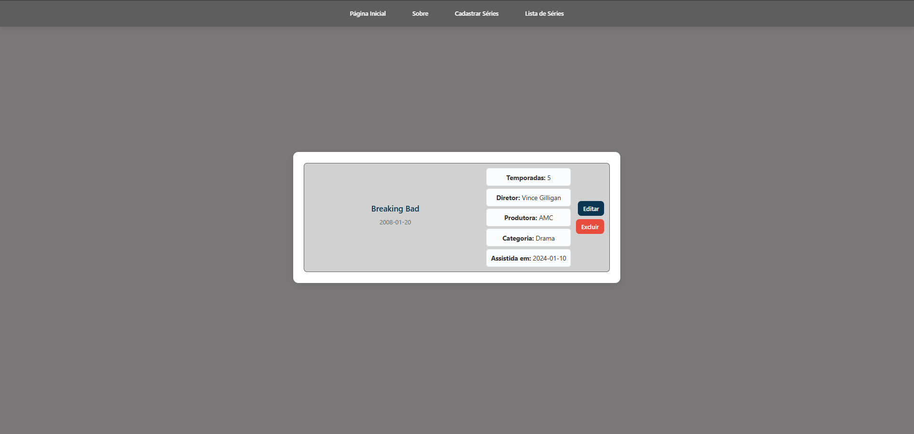

# Projeto – Fase 1

## Descrição

Aplicação desenvolvida com React + TypeScript para cadastro, listagem, edição e exclusão de séries assistidas.  
Os dados são armazenados no LocalStorage do navegador.

---

## Tecnologias Utilizadas

- React
- TypeScript
- Vite
- React Router DOM
- LocalStorage

---

## Como executar o projeto

1. Instalar as dependências:
npm install

2. Executar o projeto:
npm run dev

3. Acessar no navegador:
http://localhost:5173

---

## Testes

- Para verificar as validações do formulário, clique em **"Adicionar Série"** e tente enviar com campos vazios ou inválidos.

---

## Paginas do projeto 

 - Pagina 

 

 - Sobre 

 - Cadastrar series (SerieForm)

 Validação do SerieForm

 - Lista de series (SerieList)

 Edição das series

---

## Componentes

### NavBar
Responsável pela navegação entre as páginas do sistema.

### SerieForm
Formulário responsável pelo cadastro e edição de séries.

### SerieList
Exibe a lista de séries cadastradas e permite edição e exclusão.

### Home
Página inicial de recepção do usuário.

### Sobre
Página com informações sobre o projeto.

---

## Decisões de Desenvolvimento

- Utilização de React com TypeScript para maior segurança de tipos.
- Persistência de dados utilizando LocalStorage.
- Organização da aplicação separando components e pages.
- Uso de React Router para navegação entre telas.